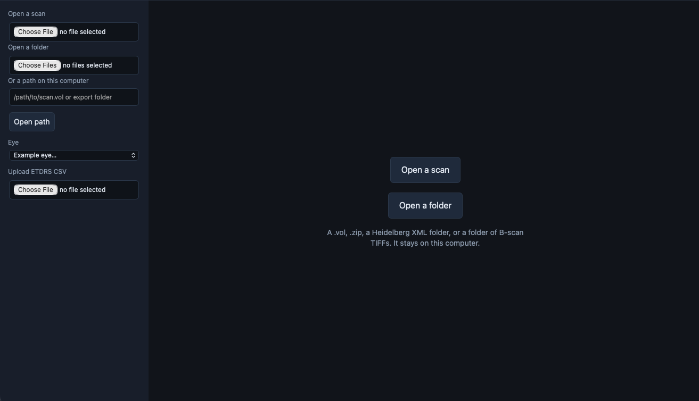
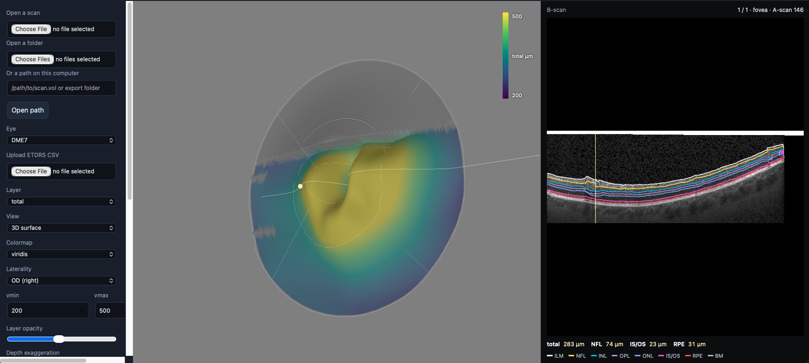
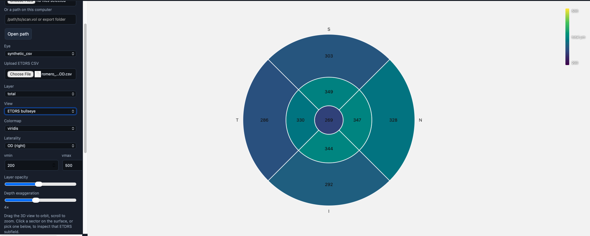
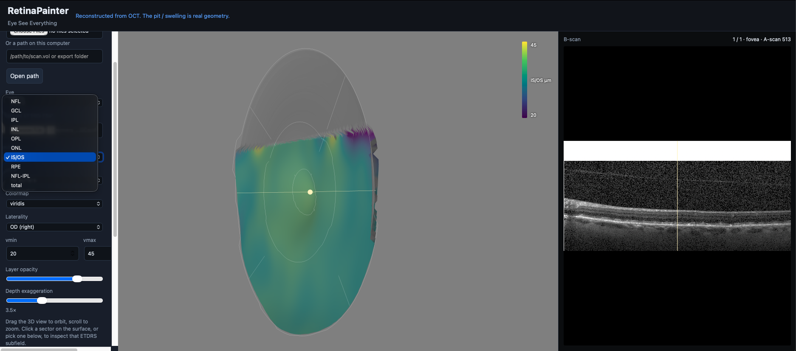
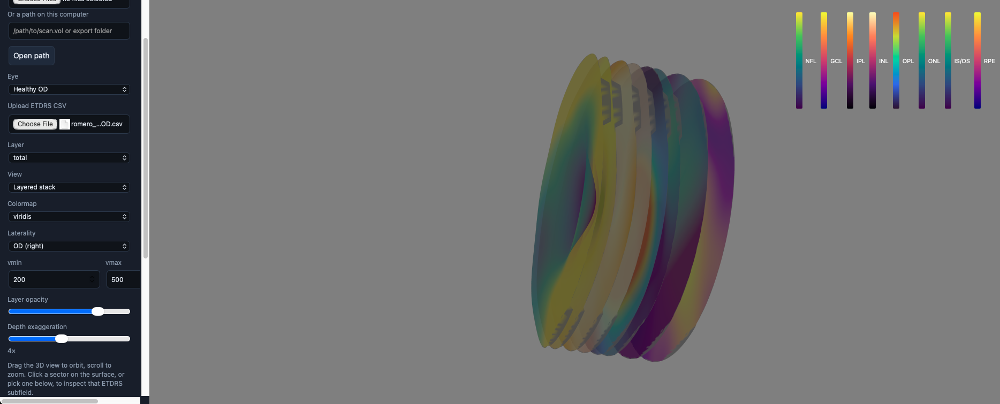

# PicEyeSo

Software that turns macular thickness into a 3D picture, in the same sense
[BrainPainter](https://razvanmarinescu.com/publication/brainpainter/) turns a
list of numbers into a brain. An ETDRS table or an OCT volume becomes a macular
cap whose *shape* is the thickness. A 200 µm sector next to a 300 µm one is a
valley, not only a colour.

[Gallery](https://rahulnadkarni.github.io/piceyeso/) ·
[Download the app](https://rahulnadkarni.github.io/piceyeso/app.html)

The source is not public. For access, collaboration, or a methods question,
contact [Rahul Nadkarni](https://github.com/RahulNadkarni).

## Supported files

A patient’s scan is opened in the **desktop app**. The file is not uploaded.
The website is only a gallery of example eyes.

| What you have | Open this | Do not open |
| --- | --- | --- |
| Heidelberg Spectralis | `.vol` or `.e2e` | — |
| Heidelberg export | the folder or `.zip` (`.xml` **plus** the TIFF B-scans) | the `.xml` by itself |
| Topcon | `.fda` | — |
| Zeiss Cirrus | a DICOM export (a `.dcm` / `.dicom`, or a folder of extensionless DICOM files) | the native `.img` cube |
| B-scan TIFF stack | the folder of `.tif` / `.tiff` (or one file from that folder) | a single photo TIFF with no siblings |
| Nine ETDRS sector thicknesses | type them in the app, or upload a table | a PDF printout, a JPEG, or a screenshot |

PDF, PNG, and JPEG are not volumes. If you only have the nine numbers,
type them under **Type values**.

## How to use

1. [Download PicEyeSo](https://rahulnadkarni.github.io/piceyeso/app.html)
   for Mac, Windows, or Linux.
2. **Mac: Apple will block the first open.** The app is not signed or
   notarized. Double-click shows “Apple cannot check it for malicious
   software” (or Move to Trash). That is expected.
   - Right-click PicEyeSo → **Open** → **Open**.
   - If it still refuses: System Settings → Privacy & Security →
     **Open Anyway**, then Open.
   Prefer the disk image when it is on the download page.
3. A PicEyeSo window opens. It is its own application, not a browser tab.
4. **Open a scan** for a `.vol`, `.e2e`, `.fda`, or DICOM.
   **Open a folder** for a TIFF stack, a Heidelberg XML+TIFF export, or a
   Cirrus DICOM folder. You can also paste a path. Or **Type values**
   and enter the nine ETDRS sector thicknesses.
5. A volume takes a minute or two (B-scans show first, then the 3D cap).
   Typed ETDRS numbers move the surface immediately.
6. Drag to orbit, scroll to zoom. Click the cap (or a sector on the left)
   to see that B-scan. Thickness is the shape, not only the colour.
7. **Layer** picks which slab drives the surface. **View** can switch from
   the 3D cap to the ETDRS bullseye or a layered stack.
8. **Export PNG** writes a picture of the current view. Opened scans stay
   on this computer (Application Support on Mac, local app data on
   Windows).

## Screenshots

**Empty window.** Open a scan, a folder, or type nine ETDRS numbers.

**OCT volume.** Thickness is the 3D shape. The line on the cap is the B-scan
on the right (DME7).

**ETDRS bullseye.** Same nine numbers as a CSV, no volume required.

**Layer.** The dropdown is which slab moves the surface (here IS/OS).

**Layered stack.** Each retinal layer as its own disc.

## For researchers and academics

The [public gallery](https://rahulnadkarni.github.io/piceyeso/) is the
citable front end: example eyes, nine ETDRS numbers you can type, and
the same 3D cap a reader can orbit. The page does not show anomaly scores.

Use the [desktop app](https://rahulnadkarni.github.io/piceyeso/app.html)
when you need a clinic volume, not only a nine-number table. Device layer
lines are kept when the file already has them. Sectors the scan does not
cover stay blank. A follow-up movie is interpolated visits of **one** eye —
do not morph two different eyes.

BrainPainter (Marinescu et al., MICCAI MBIA 2019) is the model: numbers in,
a 3D object out. Duke public OCT (Srinivasan et al., *Biomed. Opt. Express*
2014) is used only as published example data.

Methods, a research license, or a collaboration: contact
[Rahul Nadkarni](https://github.com/RahulNadkarni).

## License

Copyright © 2026 Rahul Nadkarni. **All rights reserved.** This is not MIT
or another open-source license. The gallery and desktop app may be used to
view your own data on your own machine. Source may not be copied or
redistributed without permission. See `LICENSE`. For a research license,
contact [Rahul Nadkarni](https://github.com/RahulNadkarni).
